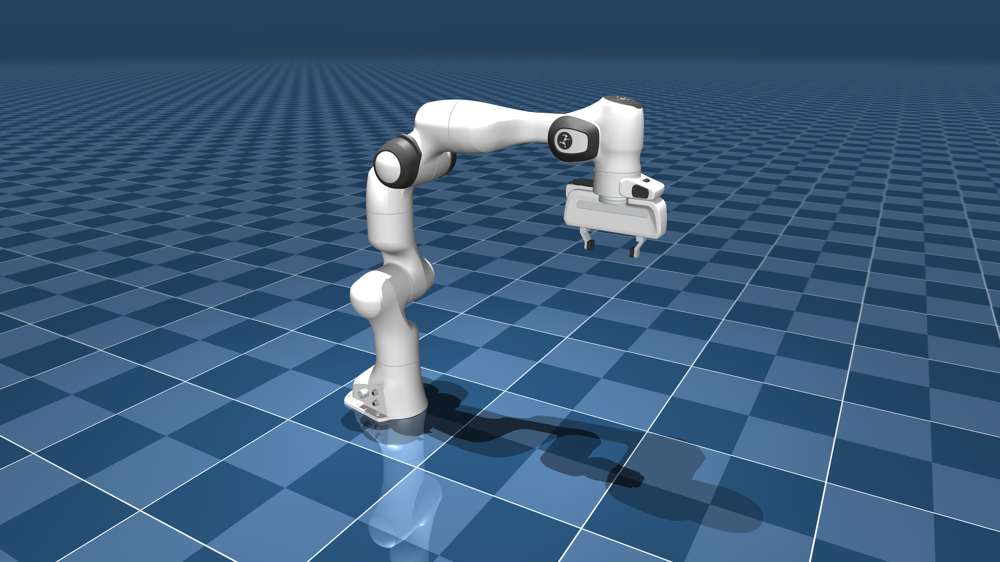

# Franka Emika Panda 描述（MJCF，中文）

> [!IMPORTANT]
> 需要 MuJoCo 2.3.3 或更高版本。

## 变更记录

完整历史请见 [CHANGELOG.md](./CHANGELOG.md)。

## 概览

本包包含 [Franka Emika](https://www.franka.de/company) 公司 [Franka Emika Panda](https://www.franka.de/) 机械臂的简化 MJCF 描述。
该模型来源于公开可用的 URDF 描述：
<https://github.com/frankaemika/franka_ros/tree/develop/franka_description>

  

## URDF 到 MJCF 的转换步骤

1. 使用 [Blender](https://www.blender.org/) 将 DAE 网格文件转换为 OBJ。  
2. 使用 [`obj2mjcf`](https://github.com/kevinzakka/obj2mjcf) 处理 `.obj` 文件。  
3. 从 `link0` 生成的子网格中移除完全平面的 `link0_6`。  
4. 对 `link5` 的 STL 碰撞网格使用 [V-HACD](https://github.com/kmammou/v-hacd) 做凸分解。  
5. 在 URDF 的 `<robot>` 中加入 `<mujoco> <compiler discardvisual="false"/> </mujoco>`，保留可视化几何。  
6. 将 URDF 载入 MuJoCo 并导出对应 MJCF。  
7. 与 [inertial.yaml](https://github.com/frankaemika/franka_ros/blob/develop/franka_description/robots/common/inertial.yaml) 对齐惯性参数。  
8. 为底座添加跟踪光源。  
9. 手工整理 MJCF，将公共属性抽取到 `<default>`。  
10. 添加 `<exclude>`，避免 `link7` 与 `link8` 的碰撞。  
11. 手工设计指尖碰撞几何。  
12. 为机械臂添加位置控制执行器。  
13. 添加约束，使左指跟随右指的位置。  
14. 添加 tendon，让两指平均分担力，并在该 tendon 上添加位置执行器。  
15. 添加 `scene.xml`，其中包含机器人、纹理地面、天空盒与雾化效果。  

### MJX

本仓库还提供了 Franka Emika Panda 的 MJX 版本，步骤如下：

1. 新增 `mjx_panda.xml`（由 `panda.xml` 派生）。  
2. 新增 `mjx_scene.xml` 与 `mjx_single_cube.xml`（由 `scene.xml` 派生）。  
3. 简化夹爪碰撞几何，并为手部新增胶囊碰撞几何。  
4. 调整求解器参数以提升性能。  
5. 降低执行器 `kp` 与 `kv`，提高仿真稳定性。  
6. 为夹爪新增 `site`。  
7. 移除 tendon，改为夹爪位置执行器，并调整夹爪 `ctrlrange`。  

## 许可证

该模型采用 [Apache-2.0 许可证](LICENSE)。
